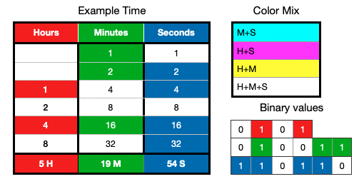

# RGB Binary Clock v1.2.9 for Arduino 🕓

Try the RGB Binary Clock v1.2.9 Web UI with Arduino COM port support!
(On request)

This repository contains my RGB Binary Clock project for the Arduino Nano, originally created many years ago.

**Size**
* **Arduino Nano (ATmega328P):** 30 KB
* **Web UI:** 650 KB

**Hardware requirements**

* Arduino Nano, 6x RGB LEDs with resistors

* I2C: RTC DS3231/DS3232, LCD 16x2, TEA5767 (FM Radio), PCA8574 I2C IO expansion board

* Active buzzer, PS2 joystick

**Optional**

* I2C: SHT30 (temp & humidity), BMP280 (temp & pressure)

* RF: LoRa MeshCore Companion Radio Clients

The project outputs various data via the Serial Monitor at a baud rate of 115200 and includes a Web UI for full control, which also supports the Novation Launchpad X!

My Arduino firmware also includes a built-in mini menu (FM radio, sensors, Web UI control) controlled via a PS2 joystick module.

## How does it actually work? 🔴🟢🔵🔴🟢🔵
6 RGB LEDs. Each RGB LED represents a combination of hours, minutes and seconds.

Each RGB LED has three colors: red, green and blue. By mixing these colors, you can create CMYW colors.

The **1st and 2nd LEDs** can only represent minutes and seconds.

For example, in the table above, the LED colors correspond to a specific time:
1. Green
2. Cyan
3. Magenta
4. Off
5. White
6. Blue

## How to read it 📖🧐

**Red** = hours

**Green** = minutes

**Blue** = seconds

Understanding color combinations lets you read the time visually.

The logic uses binary-weighted 6-bit representations for the **RGB LEDs** and operates on a 12-hour format.

The **LEDs**, starting from the first (top) one, represent binary values: 1, 2, 4, 8, 16, 32 for minutes and seconds.

Hours start from the **3rd LED**: 1, 2, 4, 8.

You can physically rearrange the LEDs or adjust it in the code.

## License 📄
[MIT](LICENSE)
