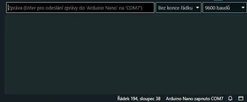

# RGB Binary Clock v1.1 for Arduino with RTC and I2C LCD support 🕓

This repository contains my RGB Binary Clock project for the Arduino Nano, originally created many years ago.

I have updated it to also include support for RTC, I2C LCD and time adjustment via the Serial Monitor.

The hardware setup is minimal: Arduino Nano, 6 RGB LEDs, resistors and RTC DS3231/DS3232. The I2C LCD is a useful addition if you want to learn binary values or just display the time with the date and temperature.

The project outputs date, time, and temperature data via the Serial Monitor at a baud rate of 9600.

Pins are easily configurable for additional LEDs in the following arrays: `hourLEDs[]`, `minuteLEDs[]`, `secondLEDs[]` and `loopLEDs[]`.

Using the Arduino Library Manager, install "*Time* by *Michael Margolis*", "*DS3232RTC* by *Jack Christensen*" and "*LiquidCrystal_I2C* by *Martin Kubovčík*".

## How does it actually work? 🔴🟢🔵🔴🟢🔵
6 RGB LEDs. Each RGB LED represents a combination of hours, minutes and seconds.

Each RGB LED has three colors: red, green and blue. By mixing these colors, you can create CMYW colors.

The **1st and 2nd LEDs** can only represent minutes and seconds.

For example, in the table above, the LED colors correspond to a specific time:
1. Green
2. Cyan
3. Magenta
4. Off
5. White
6. Blue

## How to read it 📖🧐

**Red** = hours

**Green** = minutes

**Blue** = seconds

Understanding color combinations lets you read the time visually.

The logic uses binary-weighted 6-bit representations for the **RGB LEDs** and operates on a 12-hour format.

The **LEDs**, starting from the first (top) one, represent binary values: 1, 2, 4, 8, 16, 32 for minutes and seconds.

Hours start from the **3rd LED**: 1, 2, 4, 8.

You can physically rearrange the LEDs or adjust it in the code.

## How to change the time via the Serial monitor? 🛠️

The 24H version uses the format: HH MM SS DD MM YYYY

For example, entering "15 35 00 03 04 2026" (no quotes) sets the time to 15:35:00 on 3.4.2026.

The AM/PM US version uses the format: HH MM SS AM_PM MM DD YYYY

For example, entering "03 35 00 1 04 03 2026" (no quotes) sets the time to 03:35:00 PM on 4/3/2026.
AM_PM parameter:
AM = 0
PM = 1

## License 📄
[MIT](LICENSE)
